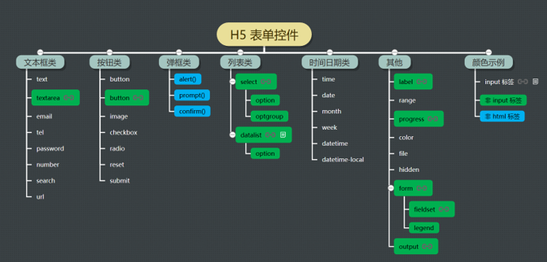
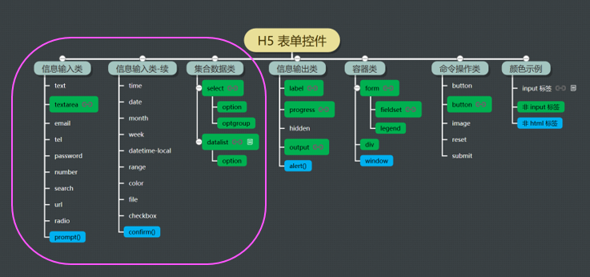

## H5表单控件

+ 可以按照表示的信息对H5表单控件进行分类：

+ 同样H5表单控件可以按照控件信息的输入、输出和操作等功能分类

注意，输入类的控件一般同时可以用来输出，例如：矩形计算器中，面积和周长数据的输出用的是文本框。

但是输入类的控件一般会以输入信息为主要用途，用于输出，需要特别考虑一下，是否合适，当然，还需要设置控件 disable，屏蔽输入功能。输出类的控件只能输出，没有任何歧义。

容器类的控件 page 相当于 HTML 标签中的 body，代表整个页面

### 阅读参考资料

+ 这篇文章对表单控件的MDN文档进行了整理：https://spa.wangding.in/task04.html

举例说明：

`<input type="range"/>`

对于这样一个表单控件需要了解一下几方面的内容：

1. 明确这个表单控件的功能是什么，在HTML页面中展示的样子是什么
2. 知道这个表单控件所对应的属性值有哪些
3. 知道这个表单控件能够触发哪些事件，这些事件有哪些区别
4. 这个表单控件能够应用的范围有哪些，一般在实际生活中如何使用

### 定时器按钮

基本要求：

- 创建 10-timer-button 目录
- 使用 H5 内置控件实现
- 按钮初始状态为禁用
- 禁用状态下，点击按钮，不会有任何响应
- 倒计时 6 秒
- 每隔一秒按钮文字显示剩余秒数
- 倒计时结束后，按钮状态为启用
- 启用状态下，点击按钮，会弹出 alert 弹框

实例参考：https://fuziwang.top/spa-demo/10-timer-button/index.html

代码参考：https://github.com/fuziwang/spa-demo/tree/master/10-timer-button

### 密码可见

基本要求：

- 创建 11-password-visual 目录
- 使用 H5 内置控件实现
- 在文本框中输入任意字符，并不显示输入的字符，而显示为“点”（隐藏密码）
- 文本框的右侧有眼睛闭合的图标
- 当鼠标移到眼睛图标时
- 密码框中的密码可以正常显示
- 眼睛关闭的图标变成眼睛睁开的图标
- 当鼠标移出眼睛图标时
- 密码框中的密码不可见
- 眼睛睁开的图标变成眼睛闭合的图标
- 密码框设置为初始焦点

实例参考：https://fuziwang.top/spa-demo/11-password-visual/index.html

代码参考：https://github.com/fuziwang/spa-demo/tree/master/11-password-visual

### 滑杆

基本要求：

- 创建 12-range 目录
- 使用 H5 内置控件实现
- 用滑杆控件输入自己的年龄，滑杆的最小值为 0，最大值为 100
- 滑块拖动后，下方显示年龄数据
- 初始滑块位于最左边，下方的年龄数据为 0 岁

实例参考：https://fuziwang.top/spa-demo/12-range/index.html

代码参考：https://github.com/fuziwang/spa-demo/tree/master/12-range

### 进度条

基本要求：

- 创建 13-progress 目录
- 使用 H5 内置控件实现
- 用进度条控件模拟下载文件的进度
- 进度条控件下方有三个按钮：开始、暂停和重置
- 开始按钮点击后，进度条显示下载进度
- 暂停按钮点击后，下载进度暂停
- 重置按钮点击后，下载进度条恢复初始状态
- 多次点击开始按钮，点击一次暂停按钮，要求进度条能够暂停

实例参考：https://fuziwang.top/spa-demo/13-progress/index.html

代码参考：https://github.com/fuziwang/spa-demo/tree/master/13-progress