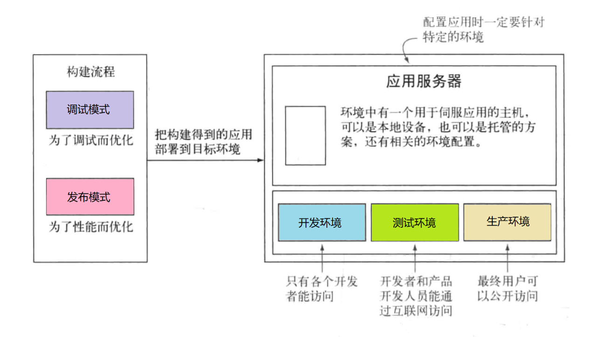
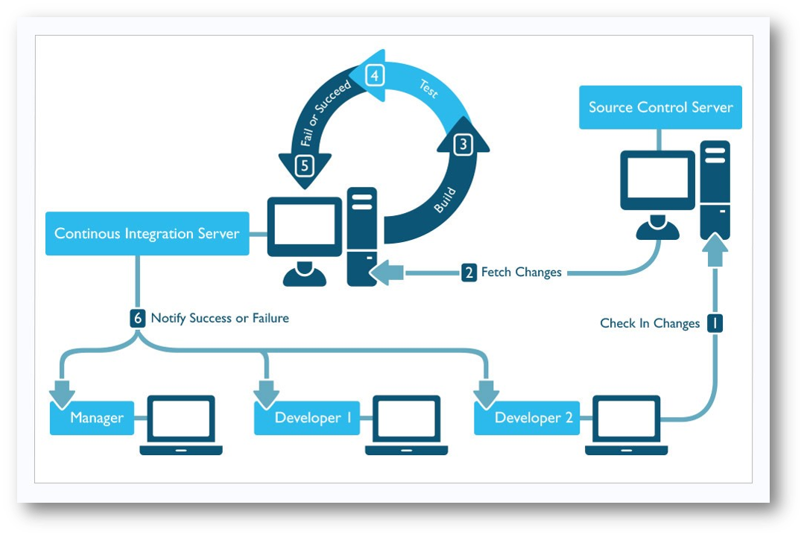

## 自动化构建

+ 脚手架：本质上脚手架是代码，不是应用程序的功能，也不时应用程序的组成部分，主要负责完成前端程序自动化的构建。（多体现在命令上，比如`create-react-app`命令）

+ 框架：框架是程序的一部分，完成程序的功能，主要为了方便组织安排功能模块

自动化构建输入的程序的代码，输出的是程序的软件

### 构建的模式和环境



自动化构建需要用到三项技术：

+ 配置管理（SVN/GIT）
+ 任务的调度（npm/grunt/gulp.js）
+ 持续集成



### 案例体现：构建GitBook

+ 在`GitHub`中创建`GitBook`仓库，注意选择`MIT`协议、`node`版本的`.gitignore`文件

+ 在本地仓库中编写文件

```bash
~/GitBook(master) » vim ch01.md ch02.md SUMMARY.md

~/GitBook(master) » cat SUMMARY.md                               
- [简介](README.md)
- [第一章](ch01.md)
- [第二章](ch02.md)
- [第三章](ch03.md)

~/GitBook(master) » npm i -g gitbook-cli # 安装gitbook脚手架

~/GitBook(master) » gitbook build # 创建gitbook 会生成_book目录 在_book目录下lrd能访问电子书
```

+ 利用分支生成`GitHub Pages` ---手动构建

```bash
~/GitBook(master) » git push
~/GitBook(master) » gitbook build
~/GitBook(master) » mv _book/* ~/tmp
~/GitBook(master) » git checkout -b gh-pages
~/GitBook(gh-pages) » rm *
~/GitBook(gh-pages) » mv ~/tmp/_book/* .
~/GitBook(gh-pages) » git add -A
~/GitBook(gh-pages) » git commit -m "book v0.1 publish"
~/GitBook(gh-pages) » git push --set-upstream origin gh-pages 
```

+ 利用自动构建生成`GitHub Pages`

在`master`分支下编写`.travis.yml`

```yml
language: node_js
node_js:
    - "node"

after_script:
  - gitbook build
  - cd ./_book
  - git init
  - git config user.name "${USER_NAME}"
  - git config user.email "${USER_EMAIL}"
  - git add .
  - git commit -m "publish gitbook"
  - git push --force --quiet "https://${ACC_TOKEN}@${GH_REF}" master:${BRANCH}

branches:
  only:
    - master
```

在`master`分支下编写`package.json`

```json
{
  "name": "gitbook",
  "version": "1.0.0",
  "description": "在线电子书",
  "main": "index.js",
  "scripts": {
    "test": "echo \"Error: no test specified\" && exit 0"
  },
  "repository": {
    "type": "git",
    "url": "git+https://github.com/fuziwang/GitBook.git"
  },
  "author": "fuziwang",
  "license": "MIT",
  "bugs": {
    "url": "https://github.com/fuziwang/GitBook/issues"
  },
  "homepage": "https://github.com/fuziwang/GitBook#readme",
  "devDependencies": {
    "gitbook-cli": "^2.3.2"             
  }
}
```

`travisCI` 持续集成 `gh-page` 并部署：https://segmentfault.com/a/1190000015274243

```txt
1a0cf5d52886dab6a55d356484c61b715a83cc29

ACC_TOKEN: d5433f9ab6a0ca4bda017b5
BRANCH: gh-pages
GH_REF: github.com/wangding/{repos_name}
USER_EMAIL: 408542507@qq.com
USER_NAME: wangding
```

部署成功后访问`GitHub Pages`

```bash
~/GitBook(master) » vim ch03.md SUMMARY.md
~/GitBook(master) » git add -A
~/GitBook(master) » git commit -m "book v0.2"
~/GitBook(master) » git push
```

在这个过程中的`git`相关的操作

+ 版本回退：`git reset HEAD^ --hard` `git reset --hard 5a4090 `

+ 分支操作：`git checkout -b gh-pages` `git branch -D gh-pages`
+ 如果让`github`上的仓库和本地的一致 `git push -f -u`